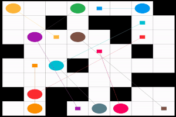

# lacam

[](LICENSE)
[](https://github.com/Kyoto-March/lacam/actions/workflows/ci.yml)

An implementation of [LaCAM](https://kei18.github.io/lacam-project/) for multi-agent pathfinding (MAPF).
See ["Implemented Techniques"](#implemented-techniques) to find out what has been implemented.
For advanced techniques, please check the project page.



## Building

All you need is [CMake](https://cmake.org/) (≥v3.16).
The code is written in C++(17).

First, clone this repo with submodules.

```sh
git clone --recursive https://github.com/Kyoto-March/lacam.git
```

Then, build the project.

```sh
cmake -B build && make -C build -j4
```

## Usage

```sh
build/main -i assets/random-32-32-10-random-1.scen -m assets/random-32-32-10.map -N 400 -v 3
```

The result will be saved in `build/result.txt`.

You can find details of all parameters with:

```sh
build/main --help
```

### Anytime Mode [[IJCAI-23]](https://kei18.github.io/lacam2)

Use `--anytime` to enable tree-rewiring refinement (LaCAM*), which iteratively improves the solution quality within the time limit.
For example, [`my_best_result.txt`](my_best_result.txt) was generated with:

```sh
build/main -i assets/random-32-32-10-random-1.scen -m assets/random-32-32-10.map -N 400 -v 3 -t 10 --anytime -o my_best_result.txt
```

### PIBT Swap [[IJCAI-23]](https://kei18.github.io/lacam2)

PIBT Swap is **enabled by default**. When two agents face each other in a narrow corridor (head-on deadlock), the swap heuristic detects this and coordinates a pull-aside maneuver at the nearest branching point. Use `--no_pibt_swap` to fall back to vanilla PIBT:

```sh
build/main -i assets/random-32-32-10-random-1.scen -m assets/random-32-32-10.map -N 400 -v 3 --no_pibt_swap
```

### Hindrance Heuristic [[SoCS-25]](https://arxiv.org/abs/2505.12623)

Hindrance is **enabled by default**. It penalizes moves that would block or increase the distance of adjacent higher-priority agents, reducing congestion in bottleneck regions. Use `--no_pibt_hindrance` to disable:

```sh
build/main -i assets/random-32-32-10-random-1.scen -m assets/random-32-32-10.map -N 400 -v 3 --no_pibt_hindrance
```

### Multi-threaded Distance Table

By default, distance tables for all agents are precomputed in parallel using multi-threading. Use `--no_dist_table_init` to switch to lazy single-threaded BFS (computes on demand):

```sh
build/main -i assets/random-32-32-10-random-1.scen -m assets/random-32-32-10.map -N 400 -v 3 --no_dist_table_init
```

## Visualizer

This repository is compatible with [mapf-visualizer](https://github.com/kei18/mapf-visualizer).
For example,

```sh
mapf-visualizer assets/random-32-32-10.map build/result.txt
```

## Implemented Techniques

- tree rewiring (i.e., LaCAM*) [[IJCAI-23]](https://kei18.github.io/lacam2)
- node reinsert [[AAAI-23]](https://kei18.github.io/lacam)
- random restart [[IJCAI-23]](https://kei18.github.io/lacam2)
- non-deterministic node extraction [[AAMAS-24]](https://kei18.github.io/lacam3)
- PIBT swap [[IJCAI-23]](https://kei18.github.io/lacam2)
- hindrance [[SoCS-25]](https://arxiv.org/abs/2505.12623)

### Roadmaps

The following techniques may be integrated in the future:
- regret learning [[SoCS-25]](https://arxiv.org/abs/2505.12623)
- iterative refinement (aka. LNS) [[IROS-21]](https://kei18.github.io/mapf-IR/)

## Experiment Utilities

You can use [mapf-lib-exp](https://github.com/Kei18/mapf-lib-exp/), written in Julia.

### Setup

```sh
git submodule add git@github.com:Kei18/mapf-lib-exp.git scripts
sh scripts/setup.sh
```

### Usage

```sh
julia --project=scripts/ --threads=auto
> include("scripts/eval.jl"); main("scripts/config/mapf-bench.yaml")
```

The results will be stored in `../data`


## License

This software is released under the MIT License, see [LICENSE.txt](LICENSE.txt).

## Acknowledgments

This project is based on [lacam0](https://github.com/Kei18/lacam0) by Keisuke Okumura.

## Notes

### install pre-commit for formatting

```sh
pre-commit install
```

### simple test

```sh
ctest --test-dir ./build
```
